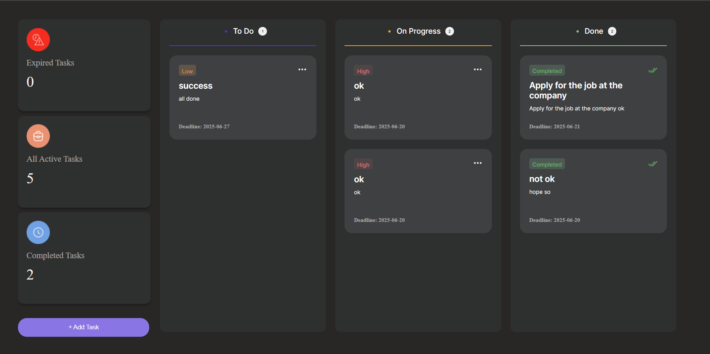
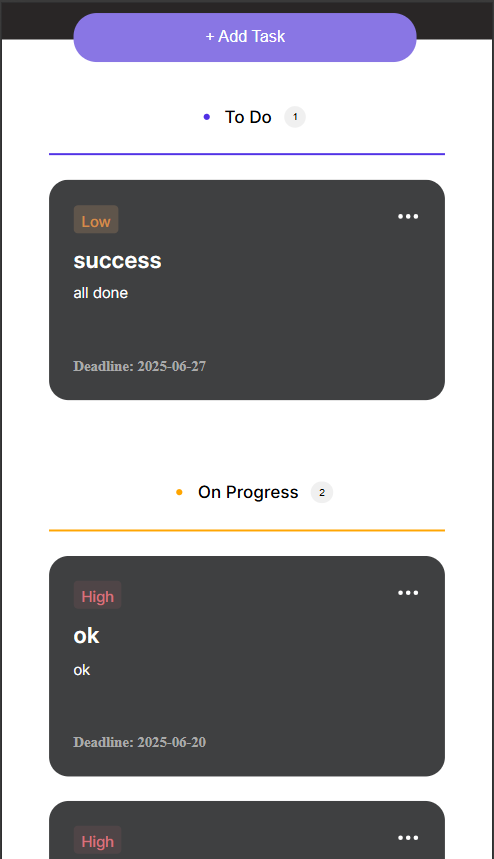

# 📋 Task Manager App

A full-stack task manager built with **Next.js, React, CSS, Node.js**, and **SQLite**. Create, update, delete, and move tasks between **To Do**, **On Progress**, and **Done** — with deadlines, priorities, and real-time UI.

---

## 🚀 Features

- Move tasks between statuses via dropdown
- Deadline selection using calendar picker
- Priorities: Low / High / Completed
- Task counters: Total, Completed, Expired
- Responsive design for desktop + mobile
- SQLite backend with Express API

---

## 🖼️ Screenshots

### Desktop View



### Mobile View



> _Screenshots are located in the `screenshots/` folder. Replace these images with your own if needed._

## 🗂️ Project Structure Overview

The project is divided into two main parts:

- **backend/**: Contains the Express server, SQLite database, and environment configuration.
- **frontend/**: Contains the Next.js app, React components, static assets, and styles.

Each folder is organized for clarity and scalability, making it easy to navigate and maintain the codebase.


## 🛠️ Setup Instructions

### 1. Clone the Repository

```bash
git clone https://github.com/thirumalamakkena/task-manager.git
cd task-manager
```

### 2. Backend Setup

1. Install dependencies:
    ```bash
    cd backend
    npm install
    ```

3. Start the backend server:
    ```bash
    node ./index.js
    ```

### 3. Frontend Setup

1. Install dependencies:
    ```bash
    cd ../frontend
    npm install
    ```

2. Start the frontend development server:
    ```bash
    npm start
    ```

3. Open [http://localhost:3000](http://localhost:3000) in your browser to view the app.

